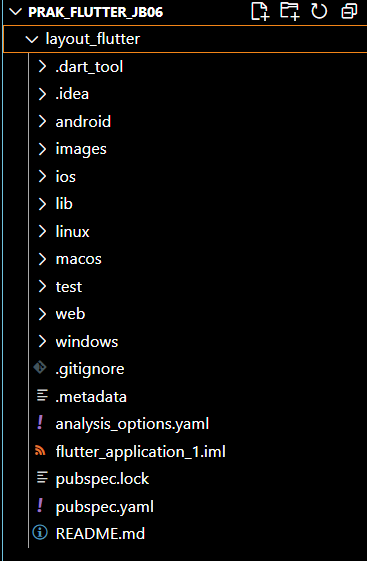
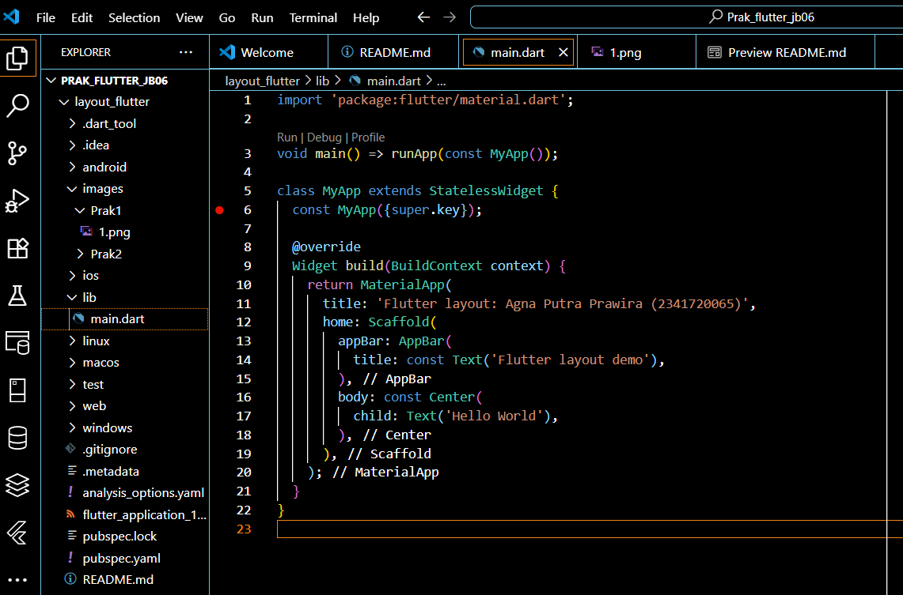
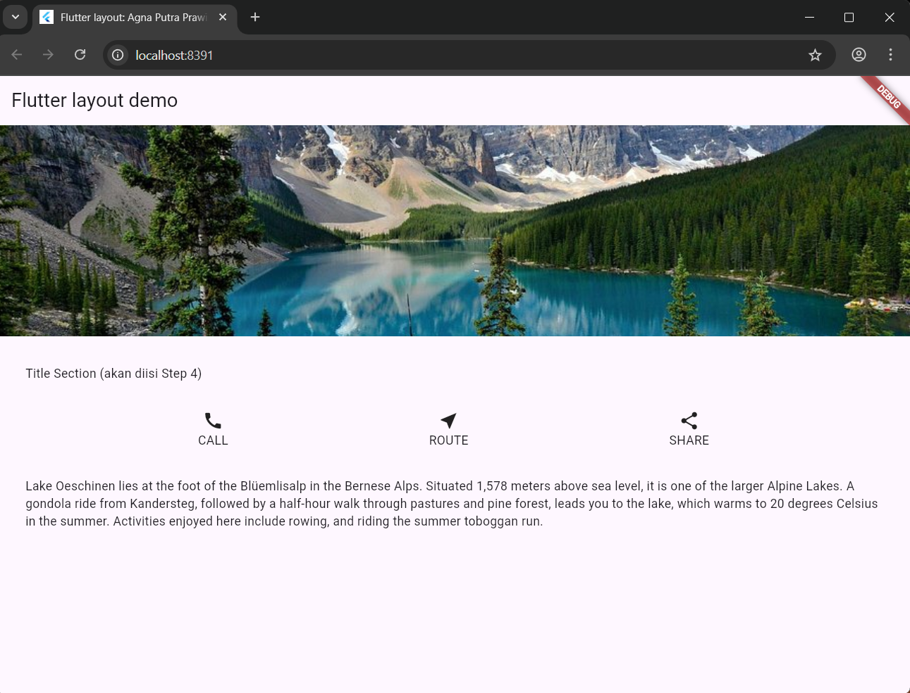
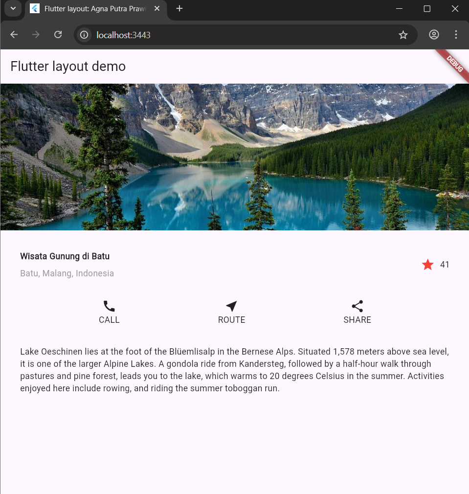
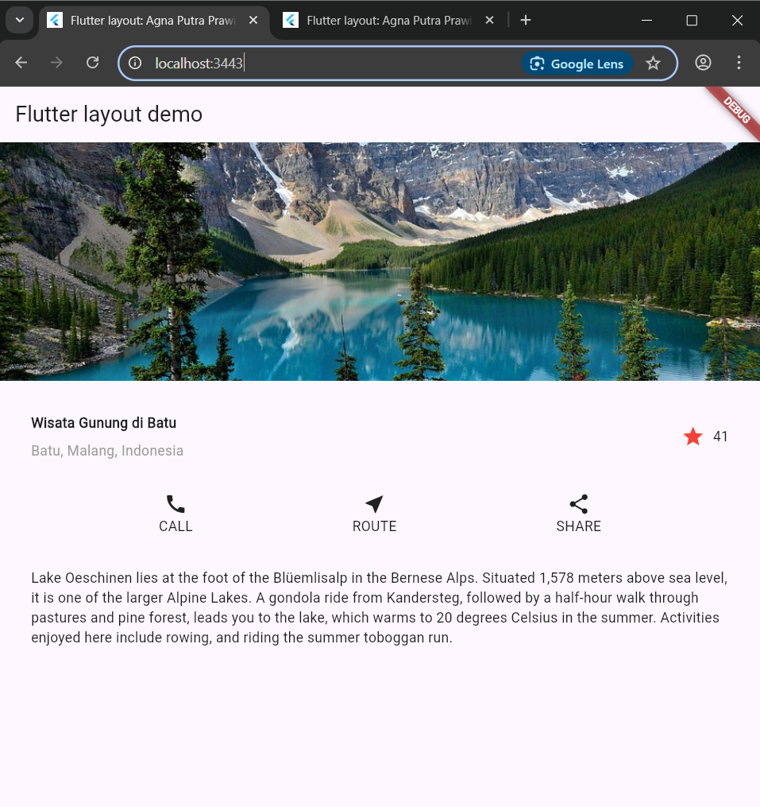
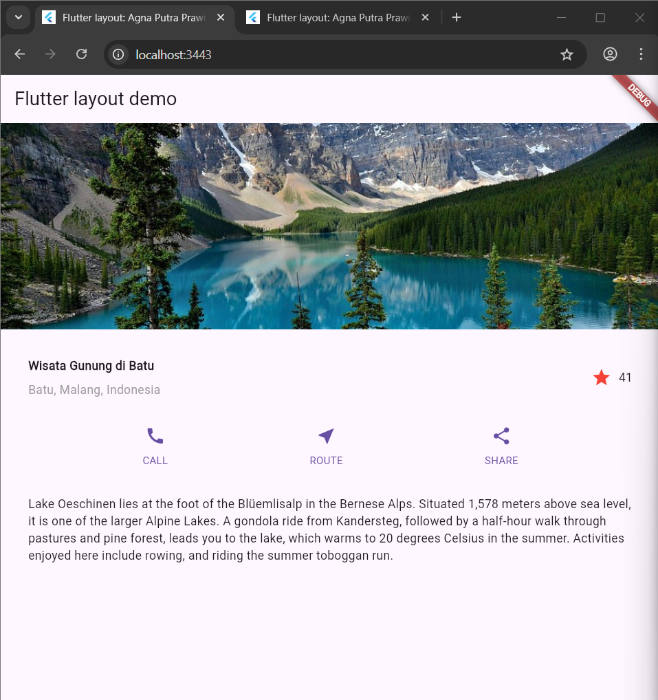
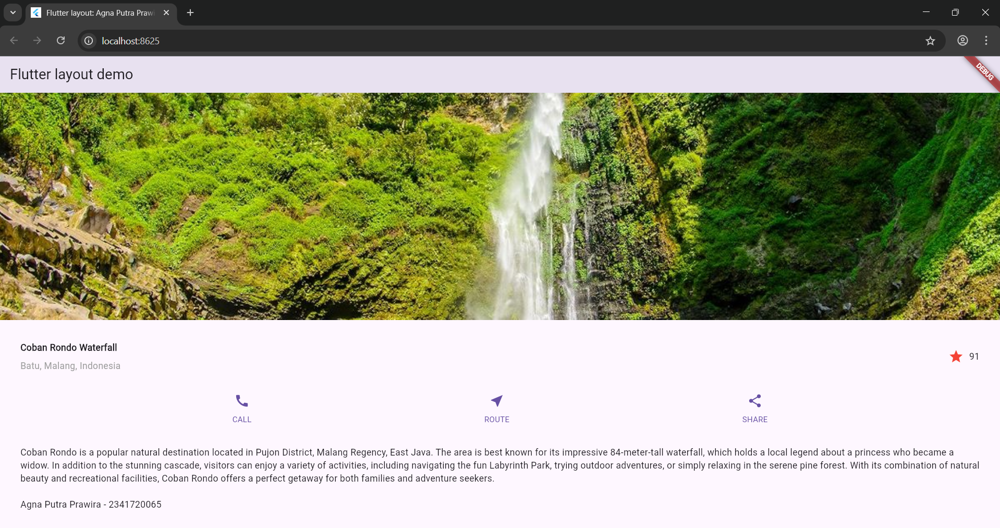
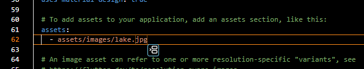
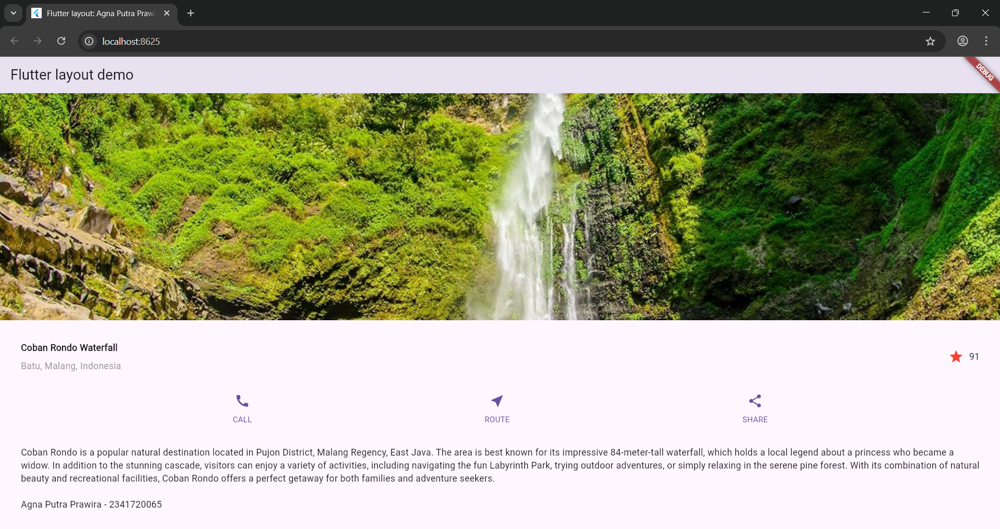
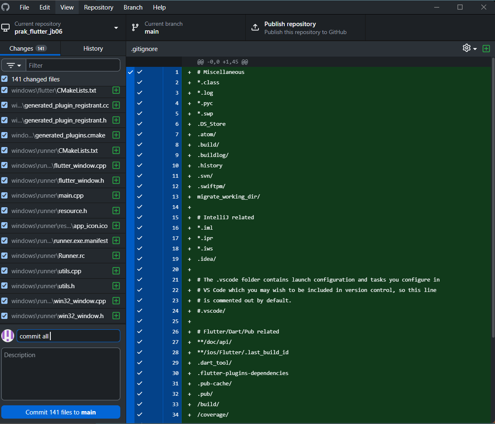

# prak_flutter_jb06

## Practical 1: Building a Layout in Flutter

### Step 1: Create a New Project
Create a new Flutter project named layout_flutter . Or customize the style of your lab report.


### Step 2: Open the filelib/main.dart
Open the file main.dartand replace it with the following code. Enter your name and student ID number in the text title.


### Step 3: Identify the diagram layout
The first step is to break down the layout into its basic elements:

Identify rows and columns.
Does the layout include a grid?
Are there any overlapping elements?
Does the UI need tabs?
Pay attention to areas that require alignment, padding, or borders.
First, identify the larger elements. In this example, four elements are arranged in a column: an image, two rows, and a block of text.



Step 4: Implement the title row
First, you'll create the left column for the title. Add the following code at the top of the method build()inside the class MyApp:
```dart:
 // 🔹 Title Section 
    Widget titleSection = Container(
      padding: const EdgeInsets.all(32),
      child: Row(
        children: [
          Expanded(
            // soal 1: Column dibungkus Expanded + crossAxisAlignment.start
            child: Column(
              crossAxisAlignment: CrossAxisAlignment.start,
              children: [
                // soal 2: Tambah padding bottom 8 + teks bold
                Container(
                  padding: const EdgeInsets.only(bottom: 8),
                  child: const Text(
                    'Wisata Gunung di Batu',
                    style: TextStyle(
                      fontWeight: FontWeight.bold,
                    ),
                  ),
                ),
                // soal 2: teks kedua warna abu-abu
                Text(
                  'Batu, Malang, Indonesia',
                  style: TextStyle(
                    color: Colors.grey[500],
                  ),
                ),
              ],
            ),
          ),
          // soal 3: icon bintang merah + angka 41
          const Icon(
            Icons.star,
            color: Colors.red,
          ),
          const SizedBox(width: 8),
          const Text('41'),
        ],
      ),
    );
```
Output:


## Practical 2: Implementation of button row
Complete the following practical steps by continuing from the previous practical.

### Step 1: Create a Column _buildButtonColumn method
The button section contains three columns that use the same layout—an icon above a line of text. The columns in this row are evenly spaced, and the text and icon are in primary colors.

Since the code to build each column is nearly identical, create a private helper method named buildButtonColumn(), which has parameters color, Iconand Text, so it can return a column with its widgets corresponding to a specific color.

lib/main.dart(_buildButtonColumn)
```dart:
class MyApp extends StatelessWidget {
  const MyApp({super.key});

  @override
  Widget build(BuildContext context) {
    // ···
  }

  Column _buildButtonColumn(Color color, IconData icon, String label) {
    return Column(
      mainAxisSize: MainAxisSize.min,
      mainAxisAlignment: MainAxisAlignment.center,
      children: [
        Icon(icon, color: color),
        Container(
          margin: const EdgeInsets.only(top: 8),
          child: Text(
            label,
            style: TextStyle(
              fontSize: 12,
              fontWeight: FontWeight.w400,
              color: color,
            ),
          ),
        ),
      ],
    );
  }
}
```
Output:


### Step 2: Create a buttonSection widget
Create a function to add an icon directly to the column. The text is inside Containerwith a margin only at the top, separating the text from the icon.

Create a row containing these columns by calling a function and assigning Iconcustom colors, , and text to the columns through parameters. Align the columns along the main axis using MainAxisAlignment.spaceEvenlyto evenly space before, between, and after each column. Add the following code directly below the declaration titleSectioninside the method build():

lib/main.dart (buttonSection)
```dart:
Color color = Theme.of(context).primaryColor;

Widget buttonSection = Row(
  mainAxisAlignment: MainAxisAlignment.spaceEvenly,
  children: [
    _buildButtonColumn(color, Icons.call, 'CALL'),
    _buildButtonColumn(color, Icons.near_me, 'ROUTE'),
    _buildButtonColumn(color, Icons.share, 'SHARE'),
  ],
);
```
Output:


### Step 3: Add a button section to the body
Add variables buttonSectionto it bodylike this:
```dart:
    // 🔹 Step 3: buttonSection sudah dimasukkan ke body
    return MaterialApp(
      title: 'Flutter layout: Agna Putra Prawira (2341720065)',
      home: Scaffold(
        appBar: AppBar(
          title: const Text('Flutter layout demo'),
        ),
        body: ListView(
          children: [
            imageSection,
            titleSection,
            buttonSection,
            textSection,
          ],
        ),
      ),
    );
```
Output:


## Practical 3: Implementation of text section
Complete the following practical steps by continuing from the previous practical.

### Step 1: Create a textSection widget
Define a text field as a variable. Enter the text inside Containerand add padding along each edge. Add the following code directly below the declaration buttonSection:
```Dart:
    // 🔹 Text Section (Praktikum 3 Step 1)
    Widget textSection = Container(
      padding: const EdgeInsets.all(32),
      child: const Text(
        'Coban Rondo is a popular natural destination located in Pujon District, '
        'Malang Regency, East Java. The area is best known for its impressive '
        '84-meter-tall waterfall, which holds a local legend about a princess who '
        'became a widow. In addition to the stunning cascade, visitors can enjoy a '
        'variety of activities, including navigating the fun Labyrinth Park, trying '
        'outdoor adventures, or simply relaxing in the serene pine forest. With its '
        'combination of natural beauty and recreational facilities, Coban Rondo offers '
        'a perfect getaway for both families and adventure seekers.\n\n'
        'Agna Putra Prawira - 2341720065',
      ),
    );
```
By setting the value softWrap= true, the line of text will fill the width of the column before wrapping at the word boundary.

### Step 2: Add text section variable to body
Add a variable widget textSectionto it bodylike this:
```dart:
        body: ListView(
          children: [
            imageSection,
            titleSection,
            buttonSection,
            textSection, // <--- ditambahkan
```
Output:


## Practical 4: Implementation of image section
Complete the following practical steps by continuing from the previous practical.

### Step 1: Prepare image assets
You can search for images online that you want to display. Create a folder imagesin the root of your layout_flutter project . Place the image files in the folder images, then set the filename to something pubspec.yamllike this:



An example of the image file name above islake.jpg

Tips

- Note that it pubspec.yamlis case sensitive, so write assets: and the image URL as shown above.
- Pubspec files are also whitespace sensitive, so use proper indentation.
- You may need to restart any running programs (either on the simulator or a connected device) for the pubspec changes to take effect.

### Step 2: Add image to body
Add image assets to it bodyas follows:
```dart:
  Widget build(BuildContext context) {
    // 🔹 Image Section
    Widget imageSection = Image.asset(
      'images/lake.jpg',
      width: 800,
      height: 400,
      fit: BoxFit.cover,
    );
```
BoxFit.covertells the framework that the image should be as small as possible but cover its entire render box.

### Step 3: Finally, convert it to ListView
In this final step, set all elements in ListView, not Column, because ListViewit supports dynamic scrolling when the application is run on devices with smaller resolutions.
```dart:
   return MaterialApp(
      title: 'Flutter layout: Agna Putra Prawira (2341720065)',
      home: Scaffold(
        appBar: AppBar(
          title: const Text('Flutter layout demo'),
        ),
        body: ListView( //<--- add this
          children: [
```
Output:


## 7. Tugas Praktikum 1
  1. Selesaikan Praktikum 1 sampai 4, lalu dokumentasikan dan push ke repository Anda berupa screenshot setiap hasil pekerjaan beserta penjelasannya di file README.md!
  2. Silakan implementasikan di project baru "basic_layout_flutter" dengan mengakses sumber ini: https://docs.flutter.dev/codelabs/layout-basics
  3. Kumpulkan link commit repository GitHub Anda kepada dosen yang telah disepakati!

ANSWER
  1. I have made the report above.
  2. I have implemented it appropriately in my practicum.
  3. 


